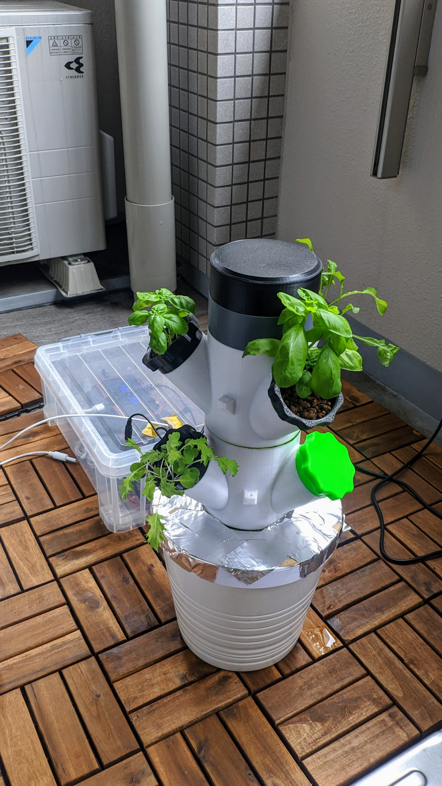

# hydroponics-controller
Using an ESP32, relays, a water pump and a TDS sensor to monitor an hydroponics tower

It's a work in progress and will be updated regularly with more documentation on how to set it up.

## BOM

1x Lolin32
https://www.aliexpress.com/item/4000340140634.html

1x keyestudio TDS Meter
https://www.aliexpress.com/item/33050818416.html

1x MOSFET D4184 modules
https://www.aliexpress.com/item/33038728761.html

1x temperature sensor
https://www.aliexpress.com/item/4000048728075.html

1x submersible pump 12V 280L/h JT-1020
https://www.aliexpress.com/item/32676666232.html

Optional:
A battery and a solar panel.

# Tower
The tower I'm using can be 3D printed from these files here:  

https://www.thingiverse.com/thing:3405964

Currently my tower is still small as I'm testing the viability first.  

Tower is connected to a 100W solar panel connected to a battery. 

I also designed a small system to start your seedlings directly into the standard pots of the original project:  

https://www.thingiverse.com/thing:4264640

